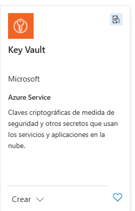
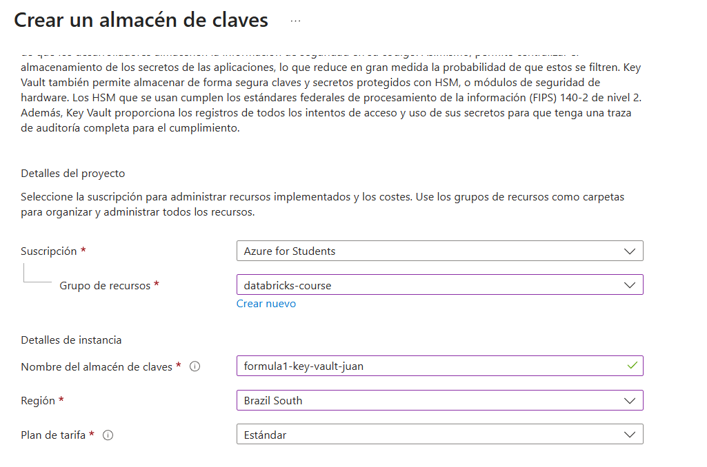
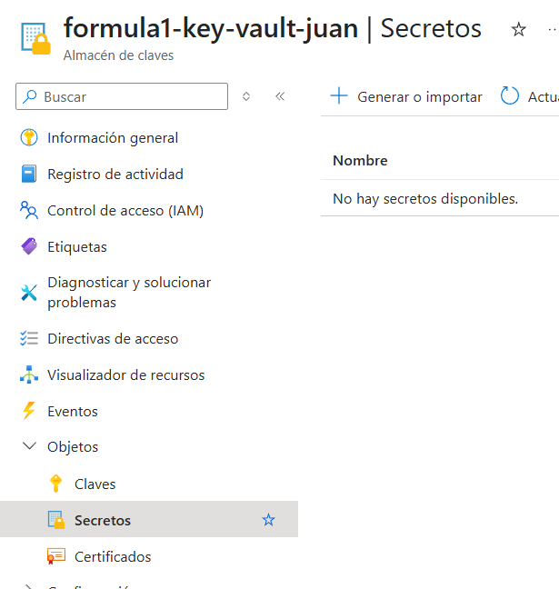
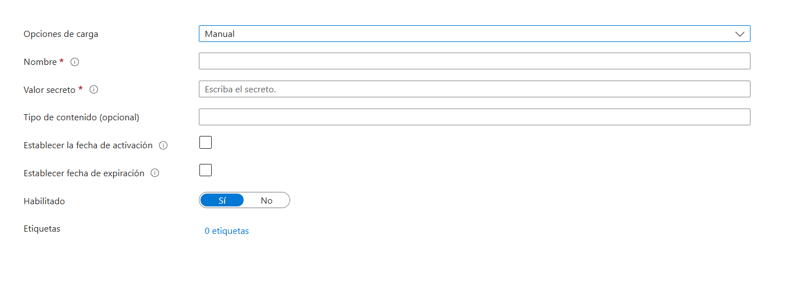
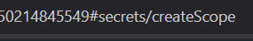
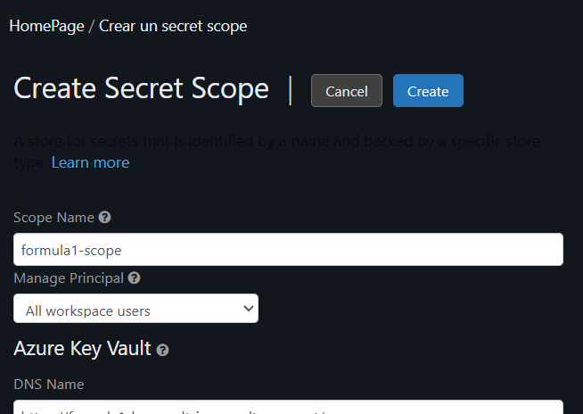
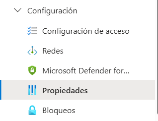

# Accesos seguros a databricks

## Databricks secret scopes

Ayuda a guardar credenciales de una forma segura y referenciadas a cuadernos, clusters o jobs. Es un servicio ofrecido por databricks

## Como implementarlo

Necesitamos añadir secretos a una key vault de Azure, luego creamos un secret scope de databricks y luego los referenciamos a un objeto, como un cluster o un nootbook.

### Creando un Azure Key Vault

Creamos este nuevo recurso en Azure.

Configuramos la key vault que se utilizara. Luego le damos a revisar y crear.

Nos vamos a la sección de secretos.

Configuramos el secreto, el valor secreto fue el generado como token en la cuenta de almacenamiento *ver DataLakes (GestionUsoDatalakes.md)*

### Creando secret scope en databricks

Para encontrar el secret scope debemos escribir desde el home page en la url lo siguiente despues del url predeterminado

Luego podemos crear el secret scope aqui 

Ahí nos pedira algunos datos que necesitamos como el dns name y el id del recurso, los podemos encontrar en properties en el recurso 

