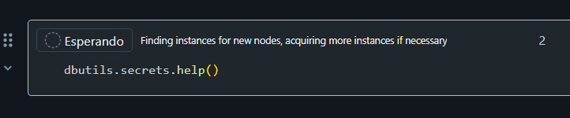
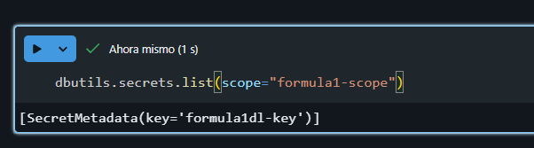
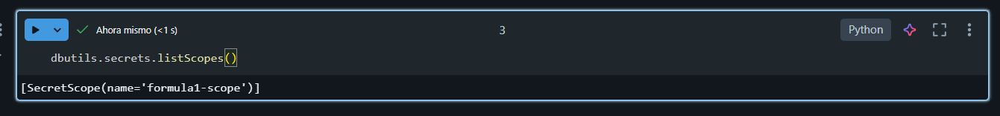
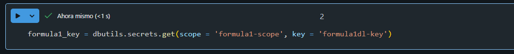
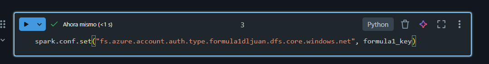

# Utilidades de los secret scope en data bricks

Ahora leugo de haber configurado los secretos entonces podemos probar sus utilidades en el cuaderno.

con esto podemos ver algunos comandos interesantes.

Con esto podemos revisar que un scope existe ya.

Con esto podemos revisar todos los scopes que tenemos.

Ahora podemos adquirir la key para utilizarla en nuestros cuadernos. Cabe decir que cuando la queremos ver no se nos permite detectarla ya que como es un secreto aparece un texto como 'REDACTED'.

Ahora la podemos utilizar para configurar spark para usar el datalake.

