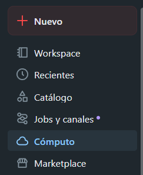
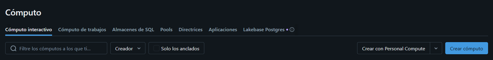
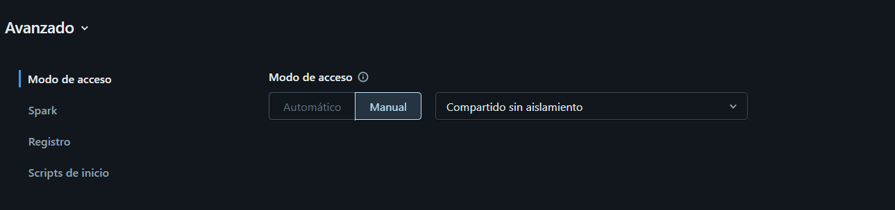

# Creando clusters en databricks

Para crear un nuevo cluster, en la barra de tareas izquierda podemos ver un botón que se llama "Computo".

Le damos al botón "crear computo".

## Configuración del cluster

Aquí ponemos el nombre del cluster y si tendrá directrices, en mi caso lo deje sin ellas.

Aquí modificaremos como funcionara el rendimiento del cluster, por ejemplo, le puse el entorno sugerido, se sugiere no utilizar los beta. Los que dicen LTS, signfica que la empresa le hace seguimiento y mantenimiento a traves de los meses.

Además, elegí un nodo relativamente pequeño con 4 nucles y 14gb de ram, ya que uno mas grande podrían ser mas costosos y realmente no se necesitan para trabajos sencillos.

Seleccionar el modo nodo unico también nos permite ahorrar en costos ya que el cluster es pequeño y no sé necesita para problemas computacionales sencillos.

Se sugiere poner los tiempos de terminación automatica cortos, para que no se consuma tanto dinero al tenerlos encendidos.

En este caso puse mi cluster como uno compartido sin aislamiento, por si en un futuro requeiro de trabajar con alguien de confianza. Recordar que el sin aislamiento no restringe lo que las personas pueden ver.

**Se da al botón crear cluster y se espera a su creación**

--- 

## Nota

Por tener membresia de estudiante y estar en la región de brasil sur, hay restricciones de que tipo de maquina virtual se puede ejecutar, suele haber muchas limitantes en cuanto a la cantidad de nucleos. Personalmente, intente con algunas hasta que me funciono una de las optimizadas

Utilizo un tipo de maquina virtual optimizada con 8 GB de ram y 4 nucleos.

En este tipo de configuración cobran 0.5 databricksUnids per hour. Puede ver la facturación que se hace por configuración en este enlace https://azure.microsoft.com/en-gb/pricing/details/databricks/

