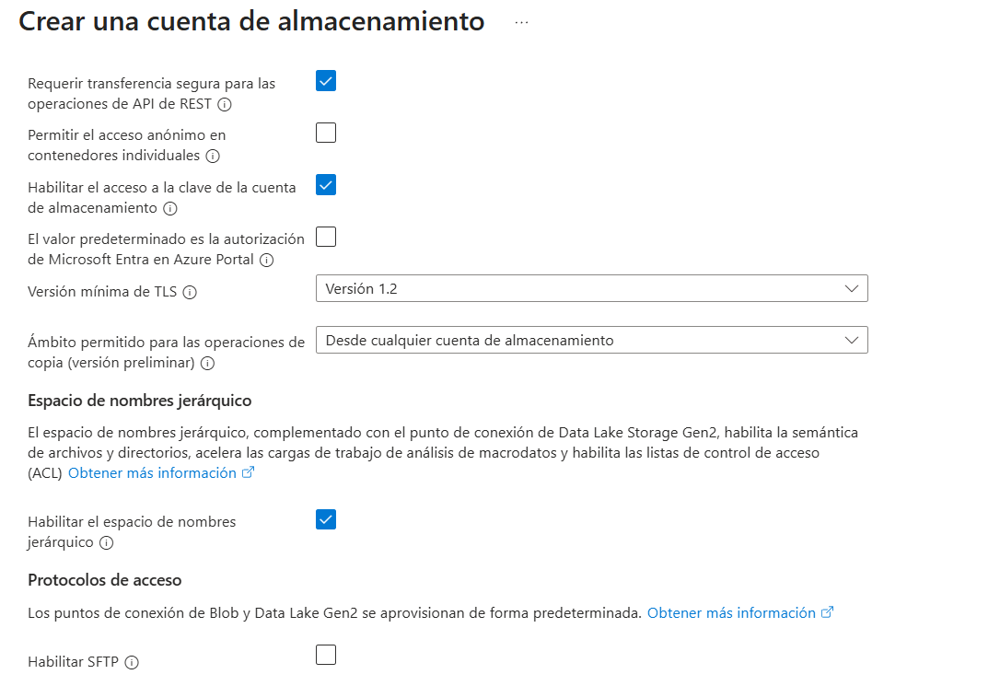

# Creación de datalakes en Azure (Gen2)

1. Buscamos storage account en los recursos de Azure

2. Configuramos el recurso de esta manera

3. Le damos en configuración avanzada y configuramos así

4. Le damos a crear y esperamos al despliegue

5. Cuando se despliegue, entonces le damos a abrir recurso. Este nos llevara a una pantalla como esta

## Creación de contenedores

Basicamente un contenedor es una unidad lógica para organizar y almacenar grupos de archivos.

1. Vamos a **Almacenamiento de datos** luego a **contenedores**, ahí podemos crear un contenedor que se llame "demo":

2. Aquí podemos cargar cualquier archivo cvs por ejemplo.

