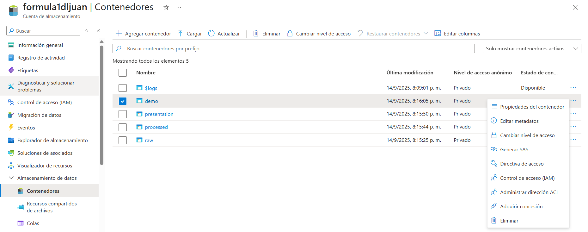

# Gestión y uso de datalakes en AZURE

Para utilizar nuestros datalakes en cuadernos de databricks, utilizamos llaves que son codigos de 512 bits que nos permiten comportarnos como superusuarios para usar los datalakes gen2.

## Configuración (no segura para subir a github o lugares publicos)

Utilizamos el siguiente comando para poder utilizar el datalake en un notebook:

spark.conf.set("fs.azure.account.key.formula1dljuan.dfs.core.windows.net", "aqui-va-la-llave")

Luego entonces utilizamos el siguiente comando para utilzar el datalake:

dbutils.fs.ls("abfss://demo@formula1dljuan.dfs.core.windows.net")

## Configuración con firmas de acceso (Es mas seguro porque podemos configurar que accesos tienen los tokens, tambien si puede leer o escribir cosas)

Para generar el token vamos al storage account, luego nos vamos a containers y le damos a los tres puntos, ahí le damos a generar SAS token.

Se configura como se desee y luego se da a generar:

Luego en el notebook se utiliza estos comando:

spark.conf.set("fs.azure.account.auth.type.container-name.dfs.core.windows.net", "SAS")

spark.conf.set("fs.azure.sas.token.provider.type.container-name.dfs.core.windows.net", "org.apache.hadoop.fs.azurebfs.sas.FixedSASTokenProvider")

spark.conf.set("fs.azure.sas.fixed.token.container-name.dfs.core.windows.net", "token")

Se debe cambiar el "container-name" con el nombre del contenedor y el token con el token que generamos.

