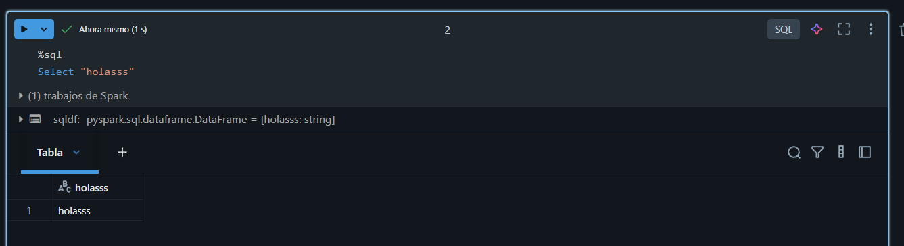
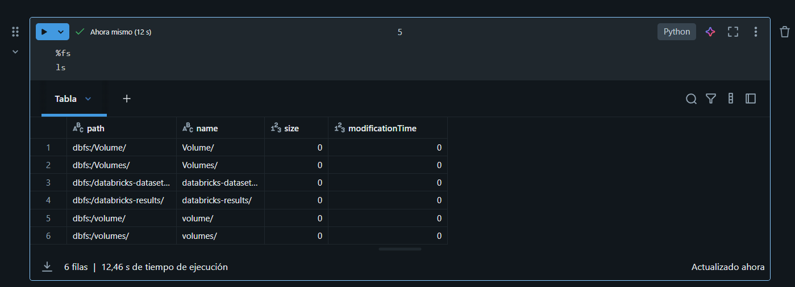

# Introducción a cuadernos de notebook

Antes de iniciar, debemos tener el cluster corriendo.

Cuando está correindo deberiamos ejecutar la opción de crear un cuaderno. Luego de crear el cuaderno deberiamos vincularlo a un cluster (el que estabamos ejecutando al incio).

Luego de esto, ya pueden ser ejecutados los códigos que hagamos.

Cabe destacar que este cuaderno funciona igual o tiene las mismas funcionalidades que uno jupyter o uno de google colab.

## Algunos comandos

* %sql permite cambiar el modo de la celda a lenguaje sql. (También se puede con scala)

* Podemos escribir con markdown con %md. Ej:

%md
#Hola, probando la documentación de nookbucks

* Podemos ejecutar comandos de file system con:

* También podemos ejecutar comandos de shell con %sh

