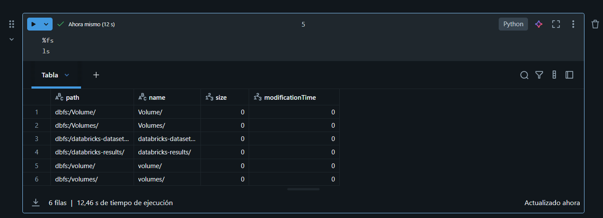
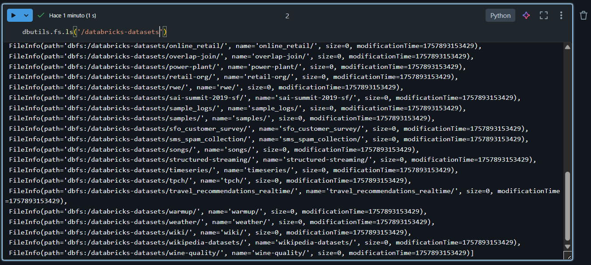
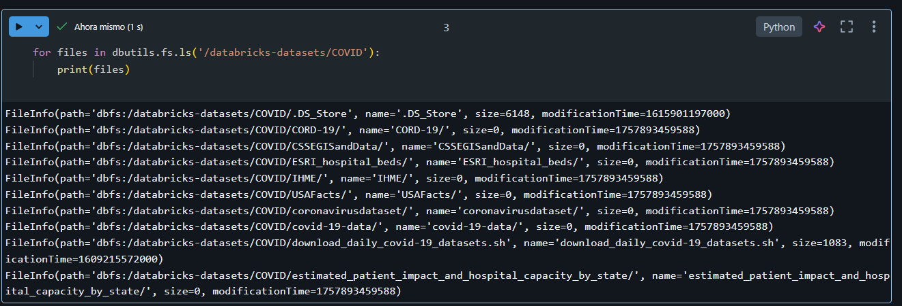

# Utilidades en cuadernos de databricks

Es un conjunto de herramientas/utilidades que facilitan tareas comunes dentro de un notebook.

## Utilidades del sistema de archivos

Podemos en vez de utilizar esto:

para listar archivos podemos utilizar esta utilidad:

**dbutils.fs.ls('/databricks-datasets')**

**VENTAJA: Al utilizar esta herramienta en vez de utilizar el comando magico, podemos combinar la salidas con lenguaje python, scala o R.**

NOTA: con el comando dbutils.help() nos permite conocer lo que podemos invocar y que hace. También podemos ser mas especificos con dbutils.fs.help().

