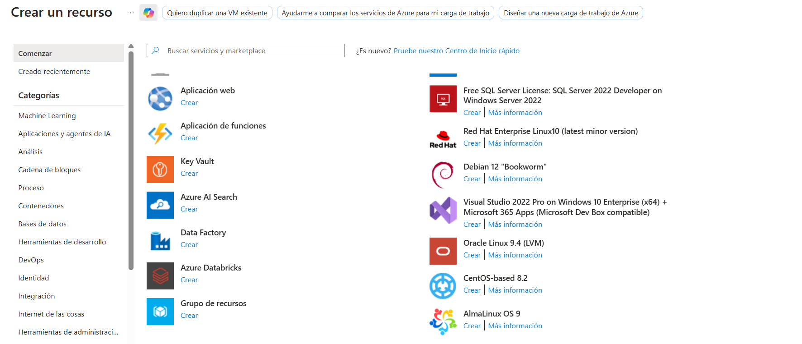
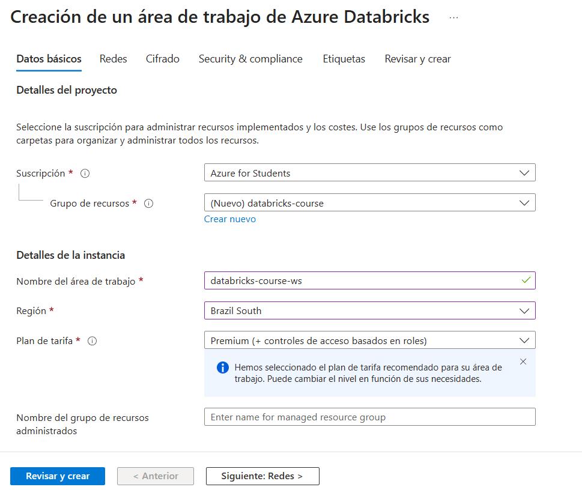
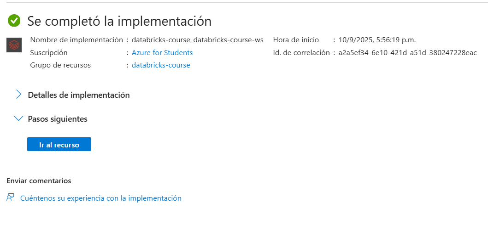

# Creando un servicio de databricks en Azure

Le damos a "CREAR UN RECURSO" y buscamos Azure databricks.

Se configura el recurso con los datos a continuación.

* El grupo de recursos es para tener mas organizado los recursos que se crearan de databricks.

* El area de trabajo se le pone un nombre mas diciente.

Luego le damos a revisar y crear.

Luego de que la implementación se complete, entonces podemos ir al recurso y entrar a el workspace de databricks.

